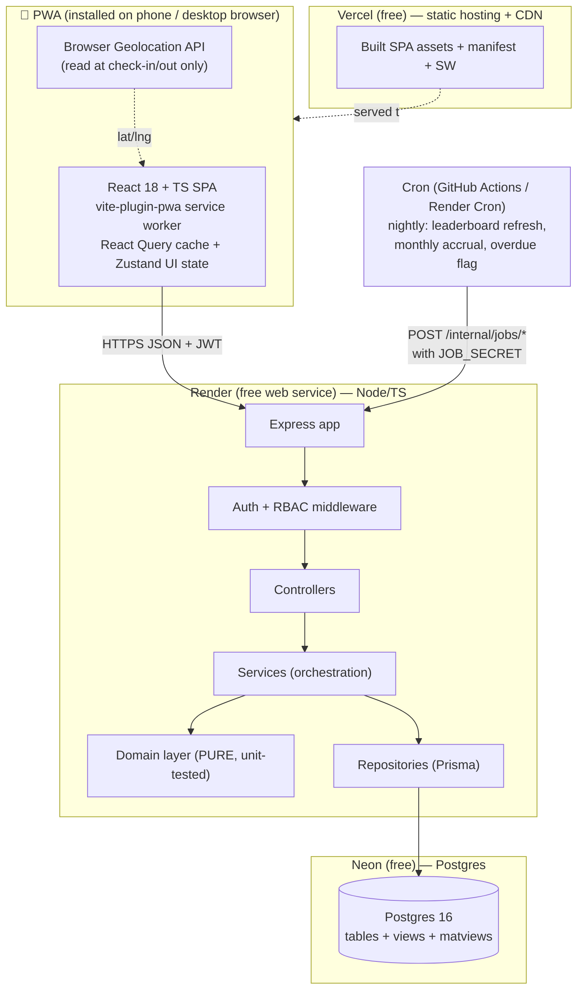
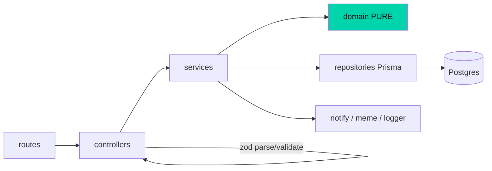

# Hustling Collaborators — Master Technical Architecture

**Document:** `docs/design/01-architecture.md`
**Status:** Authoritative engineering design (v1). Derived from `docs/PRD.md` v6.0.
**Audience:** Implementer (Founder's brother), test authors, future maintainers.
**Owner:** Engineering Manager / Principal Architect.
**Last updated:** 2026-08-01 (Asia/Kolkata).

> This document is the single source of technical truth. Where it and the PRD disagree, the **PRD wins on business rules** and this document wins on **how to build them**. Every business rule that involves math (leave accrual, comp-off, separation clawback, leaderboard, focus, day-type, salary) is specified here precisely enough to write unit tests directly from it. Open questions the Founder must confirm are collected in **§13**.

---

## Table of contents

1. System overview, goals, constraints, non-goals
2. Technology stack + rationale
3. Monorepo structure
4. Data model / ERD (tables, columns, enums, indexes)
5. REST API surface
6. Domain / service layering (pure business logic)
7. AuthN / AuthZ & RBAC
8. Cross-cutting concerns (IST, GPS, PWA, notifications, errors, config, seeding)
9. Deployment topology & CI/CD
10. Security & privacy
11. Worked numeric examples (accrual, comp-off, separation, leaderboard, salary)
12. Risks & mitigations
13. Open questions for the Founder
14. Recommended build sequence

---

## 1. System overview, goals, constraints, non-goals

### 1.1 One-paragraph description

Hustling Collaborators (HC) is a single internal **Progressive Web App** that unifies task time-tracking, campaign ownership, GPS/WFH attendance, a leave engine encoding the company Leave Policy, a comp-off flow, a company holiday calendar, employee profiles, a personal Focus-Time metric, and a public monthly leaderboard. It serves **6 team members + 1 Reporting Manager + 1 Founder (~8 users, design headroom to 10–15)**, runs on **free-tier infrastructure (target ₹0–500/month)**, uses **browser-native geolocation** (no paid SDK), and does **in-app notifications only**. All times are **Asia/Kolkata (IST, UTC+05:30)**; the financial year is **1 April – 31 March**.

### 1.2 Goals (engineering restatement of PRD §2.1)

| # | Goal | Architectural implication |
|---|------|---------------------------|
| G1 | Honest task time (actual vs estimate) | `tasks.started_at` / `completed_at` recorded silently; only Start→Done counted. |
| G2 | Replace WhatsApp attendance | GPS check-in/out + WFH toggle → `attendance_days`. |
| G3 | Encode Leave Policy exactly | Pure accrual engine + append-only `leave_ledger`. |
| G4 | Campaign ownership + auto-flag overdue | `campaigns.deadline` + derived status + notification to Lead/Manager. |
| G5 | Empowering, non-surveillance framing | Presentation-layer concern; API returns raw data, client applies Tone rules (PRD §7). |
| G6 | Full Admin edit/delete | `is_admin` gate allows write/delete on every module; hard deletes; name-typed confirm on profile delete. |
| G7 | Near-zero cost | Vercel + Render + Neon free tiers; no background jobs beyond a single free cron. |

### 1.3 Constraints

- **Cost:** must stay on free tiers. No always-on worker fleet; scheduled work runs on **one** free cron (GitHub Actions or Render Cron) hitting an internal endpoint.
- **Scale:** ~8 concurrent users, single region (India → deploy DB in an AWS/GCP region closest to India offered by Neon, e.g. `ap-southeast-1` Singapore). Latency budget is generous; no caching layer needed.
- **Offline tolerance:** PWA installable; read-mostly screens cached; writes require connectivity (attendance check-in is connectivity-gated — see §8.3).
- **Timezone:** all business-day logic is IST. Store timestamps as UTC `timestamptz`; store business dates as `date` computed in IST. (§8.1)
- **Single codebase, from scratch:** npm workspaces monorepo, TypeScript end-to-end, shared types package.

### 1.4 Non-goals (PRD §2.2)

Statutory payroll (PF/ESI/TDS); native iOS/Android; WhatsApp/email notifications; continuous/background GPS; client-facing access; audit trail of admin edits (explicitly *not* built — see §10.4).

### 1.5 Context diagram



---

## 2. Technology stack + rationale

### 2.1 Frontend

| Concern | Choice | Rationale (vs alternatives, under free-tier + from-scratch) |
|---------|--------|-------------------------------------------------------------|
| Framework | **React 18** | PRD-mandated. Largest hiring/AI-assist surface; the builder is a beginner and React has the most examples. |
| Language | **TypeScript (strict)** | Shared types with backend via `/shared`; catches contract drift at compile time. |
| Build/dev | **Vite 5** | Instant HMR, tiny config, first-class TS, best PWA plugin. Next.js rejected: SSR is unnecessary for an internal auth-gated app and complicates the free-tier split (we want static SPA on Vercel + separate API on Render). |
| PWA | **vite-plugin-pwa (Workbox)** | Generates manifest + service worker; `injectManifest`/`generateSW` handles precache + runtime caching. Installable, offline shell. |
| Server state | **@tanstack/react-query v5** | Caching, background refetch, optimistic updates for On-it/Nailed-it, retry — removes hand-rolled fetch/loading/error state. |
| Client/UI state | **Zustand** | Tiny, for cross-cutting UI state (auth session, active-task glow, admin "act-as" context, toast queue). Context used only for the auth provider. Redux rejected as overkill for 8 users. |
| Routing | **React Router v6** (data routers) | Standard; nested layouts map cleanly to the 5-tab bottom nav (Home/Tasks/Campaigns/Attendance/Profile). |
| Styling / tokens | **Tailwind CSS + CSS custom properties for design tokens** | Tailwind for speed; the exact PRD palette/typography (§6.2/6.3) is encoded once as CSS variables (`--bg-deep-space:#0F0E17`, etc.) and mapped into `tailwind.config` `theme.extend`, so the dark theme + campaign colours are single-sourced. Fonts Plus Jakarta Sans + DM Sans self-hosted (see §8.5, offline + no Google dependency). |
| Forms/validation | **react-hook-form + zod resolver** | Same zod schemas shared from `/shared` validate on client and server — one source of truth. |
| Charts | Hand-rolled SVG / lightweight bars | Focus-time 5-day trend and leaderboard are simple; avoid a chart dependency to keep bundle small and match the "no clocks/minimal" aesthetic. |
| Toasts | Custom meme-toast component | PRD §6.5 has precise anatomy + no-repeat rule; must be bespoke. |

### 2.2 Backend

| Concern | Choice | Rationale |
|---------|--------|-----------|
| Runtime | **Node.js 20 LTS** | PRD-mandated; LTS through 2026; supported on Render free. |
| Language | **TypeScript (strict)** | Shared domain types + zod schemas. |
| HTTP framework | **Express 4** | PRD-mandated; smallest learning curve, huge middleware ecosystem, trivially deployable. (Fastify would be faster but the perf headroom is irrelevant at 8 users; Express keeps the builder in familiar territory.) |
| Validation | **zod** | Runtime request validation at the controller boundary; schemas colocated in `/shared` and reused on the client. |
| Auth | **JWT (jsonwebtoken) + bcrypt** | Stateless access token (15 min) + rotating refresh token (30 d) stored httpOnly. bcrypt (cost 12) for password hashing. No third-party auth service → ₹0 and no vendor lock. |
| ORM | **Prisma** | PRD-recommended. Type-safe queries feed `/shared` types; migrations are first-class (`prisma migrate`); great for a solo builder. Raw SQL is used only for the two derived views/matviews (§4.7). |
| Config | **dotenv + zod-validated env module** | Fail fast at boot if a required env var is missing (§8.6). |
| Time | **Luxon** (or `date-fns-tz`) | All IST/FY/weekday math (`Asia/Kolkata`). Chosen over moment (deprecated). Used only in the domain layer. |
| Logging | **pino** (JSON) | Cheap, structured; free tier log volume is tiny. |
| Rate limiting | **express-rate-limit** | Basic protection on `/auth/*`. |

### 2.3 Database

| Concern | Choice | Rationale |
|---------|--------|-----------|
| Engine | **Postgres 16** | PRD-mandated; relational integrity for the ledger and reporting graph; `date`/`timestamptz` support IST logic; enums, partial indexes, materialized views. |
| Host | **Neon (free tier)** | Generous free tier, instant branching (useful for preview DBs per PR), scale-to-zero (fits ₹0 goal). Supabase is the documented fallback (also free Postgres); we do **not** depend on Supabase Auth/Storage so switching is a connection-string change. |
| Migrations | **Prisma Migrate** | Versioned SQL under `/server/prisma/migrations`; deterministic, reviewable. |

> **Note on scale-to-zero:** Neon free may pause on inactivity, adding a cold-start (~1–2 s) to the first request. Acceptable for internal use; the client shows a gentle "waking up ☕" state on first load.

### 2.4 Testing tools

| Layer | Tool | What it covers |
|-------|------|----------------|
| Domain (pure) | **Vitest** | **The priority.** Every function in §6.3 has table-driven tests + the worked examples in §11 as fixtures. Target 100% branch coverage of the domain layer. |
| API integration | **Vitest + Supertest** against a throwaway Postgres (Neon branch or local Docker) | Route → controller → service → repo happy/への RBAC/validation paths. |
| Frontend unit/component | **Vitest + React Testing Library** | Toast no-repeat logic, day-type chips, forms. |
| E2E (optional, phase 7) | **Playwright** | Critical flows: login, check-in, task On-it→Nailed-it, leave request→approve. |
| Contract | Shared **zod** schemas | Same schema validates request on server and is the source of the TS type on client — prevents drift without a separate contract tool. |

---

## 3. Monorepo structure (npm workspaces)

```
hustling-collaborators/
├─ package.json                 # workspaces: ["web","server","shared"]; root scripts (dev/build/test/lint)
├─ package-lock.json
├─ tsconfig.base.json           # shared strict compiler options; path alias @hc/shared
├─ .env.example                 # every env var, documented (see §8.6)
├─ .github/
│  └─ workflows/
│     ├─ ci.yml                 # lint + typecheck + test on PR
│     ├─ deploy-web.yml         # (Vercel auto-deploys; optional hook)
│     └─ cron.yml               # nightly/monthly jobs → POST /internal/jobs/*
├─ docs/
│  ├─ PRD.md                    # authoritative product spec (v6.0)
│  └─ design/
│     ├─ 01-architecture.md     # ← this document
│     └─ ...                    # later: 02-data-dictionary, 03-api, 04-ux, ...
├─ assets/
│  └─ hc-logo.png               # white-on-dark HC handshake mark
│
├─ shared/                      # @hc/shared — imported by BOTH web and server
│  ├─ package.json
│  ├─ src/
│  │  ├─ enums.ts               # all enums (§4.2) as const unions + values arrays
│  │  ├─ schemas/               # zod schemas (request/response DTOs), one file per module
│  │  │  ├─ auth.ts  tasks.ts  campaigns.ts  attendance.ts
│  │  │  ├─ leave.ts  compoff.ts  profiles.ts  admin.ts  leaderboard.ts
│  │  ├─ types.ts               # inferred TS types from schemas + domain value objects
│  │  └─ constants.ts           # IST_TZ, GRACE_CUTOFF, OFFICE_START, FY math consts,
│  │                            #   accrual figures, comp-off threshold, meme event keys
│  └─ index.ts
│
├─ server/                      # @hc/server — Node/Express/TS
│  ├─ package.json
│  ├─ prisma/
│  │  ├─ schema.prisma          # single source of DB schema (mirrors §4)
│  │  ├─ migrations/            # generated SQL migrations
│  │  ├─ sql/                   # raw SQL for views/matviews (focus, leaderboard)
│  │  └─ seed.ts                # holidays FY26-27, meme bank, roles, sample team (§8.7)
│  ├─ src/
│  │  ├─ index.ts               # boot: validate env → connect → mount app → listen
│  │  ├─ app.ts                 # Express app factory (testable; no listen here)
│  │  ├─ config/env.ts          # zod-validated process.env
│  │  ├─ middleware/            # requireAuth, requireAdmin, requireRole, actAs,
│  │  │                         #   requireCampaignLead, errorHandler, rateLimit, validate
│  │  ├─ routes/                # one router per module; maps to §5 table
│  │  ├─ controllers/           # parse+validate (zod) → call service → shape response
│  │  ├─ services/              # orchestration: transactions, calls domain + repos, side effects
│  │  ├─ domain/                # PURE, no I/O — the tested core (§6.3)
│  │  │  ├─ time/               # ist.ts, fy.ts, weekday.ts
│  │  │  ├─ dayType.ts  attendance.ts  leaveAccrual.ts  compOff.ts
│  │  │  ├─ separation.ts  halfDay.ts  focus.ts  leaderboard.ts  salary.ts
│  │  ├─ repositories/          # Prisma-backed data access, one per aggregate
│  │  ├─ jobs/                  # scheduled job handlers (accrual, leaderboard, overdue)
│  │  └─ lib/                   # jwt, hash, logger, meme picker, notify
│  └─ tests/
│     ├─ domain/                # Vitest unit tests (mirror §11 worked examples)
│     └─ api/                   # Supertest integration tests
│
└─ web/                         # @hc/web — React/TS/Vite PWA
   ├─ package.json
   ├─ vite.config.ts            # vite-plugin-pwa config (manifest, workbox)
   ├─ index.html
   ├─ public/                   # icons (192/512/maskable), fonts, offline fallback
   └─ src/
      ├─ main.tsx  App.tsx  router.tsx
      ├─ theme/tokens.css       # PRD palette + type scale as CSS variables
      ├─ api/                   # typed fetch client (uses @hc/shared schemas)
      ├─ store/                 # Zustand slices (session, actAs, toasts)
      ├─ features/              # home, tasks, campaigns, attendance, leave, profile,
      │                         #   leaderboard, admin, comp-off, notifications
      ├─ components/            # MemeToast, DayChip, CampaignCard, StatCard, LeaveArc...
      └─ lib/                   # geolocation, meme bank, ist formatting, install prompt
```

**Why workspaces + a `/shared` package:** the enums, zod schemas, and DTO types are authored once in `/shared` and imported by both `/web` and `/server`. A change to, say, `leave_type` is a compile error everywhere it's used. This is the single biggest lever against contract drift for a solo builder.

---

## 4. Data model / ERD

### 4.1 Conventions

- PKs are `uuid` (`gen_random_uuid()` via pgcrypto) unless noted.
- `created_at` / `updated_at` are `timestamptz default now()`; `updated_at` maintained by Prisma `@updatedAt`.
- **Business dates** (`date` type) are computed in IST (§8.1). **Instants** (check-in time, task start) are `timestamptz` in UTC.
- **Hard deletes** everywhere (PRD §4 / §10.4 — no soft delete, no audit trail). FKs use `ON DELETE CASCADE` for owned children (see the delete matrix in §10.3).
- Money (`salary_amount`) stored as `integer` **paise**? → No. Salaries here are whole-rupee monthly figures used only for an *estimate*; store as `numeric(12,2)` rupees. (§10.1)
- Leave amounts stored as `numeric(4,2)` to represent 0.5 / 1.5 day granularity.

### 4.2 Enums

| Enum (`snake_case` pg type) | Values | Source |
|-----------------------------|--------|--------|
| `employment_type` | `intern`, `full_time` | PRD §5 |
| `user_role` | `admin`, `reporting_manager`, `team_member` | PRD §3. *(Campaign Lead is **contextual**, derived from `campaigns.lead_id`, NOT a value here.)* |
| `day_type` | `office`, `wfh`, `sunday`, `fourth_saturday`, `second_saturday`, `mandatory_holiday`, `optional_holiday`, `birthday` | PRD §9.1 / §10 |
| `attendance_status` | `present`, `late`, `wfh`, `half_day`, `absent`, `on_leave`, `holiday`, `weekend_off` | PRD §4.2 / §9 |
| `leave_type` | `pl`, `lwp`, `comp_off`, `half_day`, `bereavement`, `maternity`, `paternity`, `optional_holiday` | PRD §4.3 / §9.8 |
| `request_status` | `pending`, `approved`, `rejected`, `cancelled` | PRD §9.4 / §9.8 |
| `campaign_status` | `new`, `in_progress`, `delivered`, `overdue` | PRD §11 (see derived indicator note below) |
| `task_status` | `todo`, `active`, `done` | PRD §8.2 |
| `ledger_entry_type` | `opening`, `accrual`, `deduction`, `adjustment`, `clawback`, `expiry` | derived from §8 policy |
| `notification_type` | `campaign_overdue`, `comp_off_request`, `comp_off_credited`, `leave_request`, `leave_decided`, `task_assigned`, `admin_note` | PRD §3 / §11 |

> **Campaign status vs. deadline indicator.** `campaign_status` is the persisted lifecycle. The PRD §11.2 *colour indicator* (`On track / Coming up / Due today / This one needs your attention`) is **derived at read time** from `deadline`, IST `today`, and `status`, NOT stored — so it can never go stale. `overdue` is set by the nightly job / on read when `deadline < today AND status != delivered`, purely to drive the one-time notification and the persisted flag.

### 4.3 ERD (mermaid)

```mermaid
erDiagram
    USERS ||--|| EMPLOYEE_PROFILES : "has profile"
    USERS ||--o{ EMPLOYEE_PROFILES : "manages (reporting_manager_id)"
    USERS ||--o{ TASKS : owns
    USERS ||--o{ ATTENDANCE_DAYS : records
    USERS ||--o{ LEAVE_REQUESTS : submits
    USERS ||--o{ LEAVE_LEDGER : accrues
    USERS ||--o{ COMP_OFF_REQUESTS : submits
    USERS ||--o{ COMP_OFF_CREDITS : earns
    USERS ||--o{ CALENDAR_REMARKS : "target of"
    USERS ||--o{ NOTIFICATIONS : receives
    USERS ||--o{ CAMPAIGN_MEMBERS : "member of"
    USERS ||--o{ CAMPAIGNS : leads
    CAMPAIGNS ||--o{ CAMPAIGN_MEMBERS : has
    CAMPAIGNS ||--o{ TASKS : "tagged by"
    COMP_OFF_REQUESTS ||--o| COMP_OFF_CREDITS : "may credit"
    LEAVE_REQUESTS ||--o{ LEAVE_LEDGER : "posts entries"
    COMP_OFF_CREDITS ||--o| LEAVE_LEDGER : "consumed via"
    ROLES ||--o{ ROLE_PERMISSIONS : grants
    PERMISSIONS ||--o{ ROLE_PERMISSIONS : "granted by"

    USERS {
        uuid id PK
        text email UK "citext, lowercased"
        text password_hash "bcrypt cost 12"
        user_role role "admin|reporting_manager|team_member"
        boolean is_admin "admin toggle; founder locked true"
        boolean is_founder "protected; cannot be deleted or de-admined"
        boolean is_active "false = disabled login, data retained"
        timestamptz last_login_at
        timestamptz created_at
        timestamptz updated_at
    }

    EMPLOYEE_PROFILES {
        uuid id PK
        uuid user_id FK "UK -> users.id"
        text full_name
        text employee_code UK
        text photo_url "nullable"
        employment_type employment_type
        date joining_date
        date date_of_birth "nullable"
        text designation "nullable"
        text department "nullable"
        numeric salary_amount "numeric(12,2) monthly INR; scoped read"
        uuid reporting_manager_id FK "-> users.id, nullable"
        date probation_end_date "derived+stored (see 6.3)"
        timestamptz created_at
        timestamptz updated_at
    }

    ROLES {
        text key PK "admin|reporting_manager|team_member"
        text label
        text description
    }
    PERMISSIONS {
        text key PK "e.g. task.edit_any, attendance.override"
        text description
    }
    ROLE_PERMISSIONS {
        text role_key FK
        text permission_key FK
    }

    CAMPAIGNS {
        uuid id PK
        text name
        text client_name "nullable"
        uuid lead_id FK "-> users.id"
        date deadline
        campaign_status status "new|in_progress|delivered|overdue"
        text color "one of 4 campaign colours; nullable=auto"
        timestamptz delivered_at "nullable"
        boolean overdue_notified "idempotency guard"
        uuid created_by FK
        timestamptz created_at
        timestamptz updated_at
    }
    CAMPAIGN_MEMBERS {
        uuid id PK
        uuid campaign_id FK
        uuid user_id FK
        timestamptz added_at
    }

    TASKS {
        uuid id PK
        text title
        uuid owner_id FK "-> users.id"
        uuid campaign_id FK "nullable"
        integer estimated_minutes ">0"
        task_status status "todo|active|done"
        date work_date "IST date the task counts toward"
        timestamptz started_at "nullable; set on On-it"
        timestamptz completed_at "nullable; set on Nailed-it"
        integer actual_minutes "nullable; = completed-started, mins"
        boolean within_estimate "nullable; actual<=estimate"
        uuid created_by FK
        timestamptz created_at
        timestamptz updated_at
    }

    ATTENDANCE_DAYS {
        uuid id PK
        uuid user_id FK
        date day "IST calendar date; UK(user_id,day)"
        day_type day_type
        attendance_status status
        timestamptz check_in_at "nullable"
        timestamptz check_out_at "nullable"
        numeric check_in_lat "numeric(9,6) nullable"
        numeric check_in_lng "numeric(9,6) nullable"
        numeric check_out_lat "nullable"
        numeric check_out_lng "nullable"
        boolean is_late "check_in after grace cutoff"
        boolean wfh_confirmed
        boolean admin_override "true = manually set, ignore GPS"
        uuid overridden_by FK "nullable"
        timestamptz created_at
        timestamptz updated_at
    }

    HOLIDAYS {
        uuid id PK
        date day UK
        text name
        day_type type "mandatory_holiday|optional_holiday"
        boolean seeded "true=from FY26-27 seed"
        uuid created_by FK "nullable for seeded"
        timestamptz created_at
        timestamptz updated_at
    }

    CALENDAR_REMARKS {
        uuid id PK
        uuid user_id FK "whose calendar"
        date day
        text text
        uuid created_by FK
        timestamptz created_at
        timestamptz updated_at
    }

    LEAVE_REQUESTS {
        uuid id PK
        uuid user_id FK
        leave_type leave_type
        date start_date
        date end_date
        boolean is_half_day
        numeric requested_days "numeric(4,2)"
        text reason
        request_status status
        uuid approver_id FK "nullable"
        text decision_note "nullable"
        timestamptz decided_at "nullable"
        timestamptz created_at
        timestamptz updated_at
    }

    LEAVE_LEDGER {
        uuid id PK
        uuid user_id FK
        date effective_date "IST date entry applies"
        ledger_entry_type entry_type
        leave_type leave_type "nullable for pure accrual"
        numeric amount "numeric(5,2) signed: +accrual -deduction"
        numeric balance_after "running PL balance snapshot"
        uuid source_leave_request_id FK "nullable"
        uuid source_comp_off_credit_id FK "nullable"
        text note
        uuid created_by FK "nullable=system"
        timestamptz created_at
    }

    COMP_OFF_REQUESTS {
        uuid id PK
        uuid user_id FK
        date off_date "the off day to be worked"
        uuid campaign_id FK "nullable planned work"
        text planned_work
        text reason
        request_status status
        uuid approver_id FK "nullable"
        timestamptz decided_at "nullable"
        timestamptz created_at "MUST be < off_date start (IST)"
        timestamptz updated_at
    }

    COMP_OFF_CREDITS {
        uuid id PK
        uuid user_id FK
        date credited_for_date "the off day worked"
        uuid comp_off_request_id FK "nullable if admin-granted"
        date expires_on "31 Mar of that FY"
        boolean consumed
        uuid consumed_by_leave_request_id FK "nullable"
        date consumed_on "nullable"
        uuid credited_by FK
        text note
        timestamptz created_at
    }

    NOTIFICATIONS {
        uuid id PK
        uuid recipient_id FK
        notification_type type
        text title
        text body
        jsonb payload "entity ids for deep-link"
        boolean is_read
        timestamptz created_at
    }
```



### 4.4 Reporting relationships

Modeled as `employee_profiles.reporting_manager_id → users.id` (self-referential through users). This is the **current** manager. Rationale: at 8 people, reporting is a single edge; a temporal history table is over-engineering. Routing (leave approval, overdue notifications, focus/coaching visibility) reads this FK. If org history is ever needed, add `reporting_relationships(user_id, manager_id, from_date, to_date)` later without breaking anything — flagged as an open question (§13).

### 4.5 Roles / permissions

`roles`, `permissions`, `role_permissions` are **seeded reference tables** documenting the RBAC matrix (§7). At runtime the middleware enforces authorization from **`users.role` + `users.is_admin` + contextual campaign-lead check in code** (fast, no join per request). The tables exist so the permission matrix is queryable/auditable and so an admin UI could render it, but they are not on the hot path. This satisfies the PRD's "roles/permissions" requirement without a heavyweight policy engine that 8 users don't need.

### 4.6 Index plan

| Table | Index | Purpose |
|-------|-------|---------|
| users | `UNIQUE(email)` | login lookup |
| employee_profiles | `UNIQUE(user_id)`, `UNIQUE(employee_code)`, `INDEX(reporting_manager_id)` | profile fetch, manager's reportees |
| tasks | `INDEX(owner_id, work_date)`, `INDEX(campaign_id)`, `INDEX(status) WHERE status='active'` (partial) | daily task list, campaign rollup, active-task glow |
| attendance_days | `UNIQUE(user_id, day)`, `INDEX(day)` | one row/day, calendar & monthly leaderboard scans |
| leave_requests | `INDEX(user_id, status)`, `INDEX(approver_id, status) WHERE status='pending'` (partial) | member history, approver inbox |
| leave_ledger | `INDEX(user_id, effective_date)` | balance reconstruction in order |
| comp_off_requests | `INDEX(user_id)`, `INDEX(status) WHERE status='pending'` | approver inbox; pre-approval check |
| comp_off_credits | `INDEX(user_id) WHERE consumed=false AND expires_on>=CURRENT_DATE` (partial) | available comp-off balance |
| holidays | `UNIQUE(day)` | calendar resolution |
| calendar_remarks | `INDEX(user_id, day)` | per-day remark fetch |
| campaign_members | `UNIQUE(campaign_id, user_id)`, `INDEX(user_id)` | membership, "my campaigns" |
| campaigns | `INDEX(status)`, `INDEX(deadline) WHERE status!='delivered'` (partial) | overdue scan |
| notifications | `INDEX(recipient_id, is_read, created_at DESC)` | notification bell |

### 4.7 Derived views / materialized views

**`focus_time_daily` (plain VIEW)** — no persistence needed; recomputes cheaply.

```sql
CREATE VIEW focus_time_daily AS
SELECT
  owner_id            AS user_id,
  work_date           AS day,
  COALESCE(SUM(actual_minutes) FILTER (WHERE status='done'), 0) AS focus_minutes,
  COUNT(*) FILTER (WHERE status='done')                         AS tasks_done
FROM tasks
GROUP BY owner_id, work_date;
```

**`leaderboard_monthly` (MATERIALIZED VIEW)** — the 3-factor score (PRD §14.1), refreshed nightly by the cron job and on-demand after a month closes. Divide-by-zero factors resolve to `NULL` and are excluded from the average (see domain rule §6.3 / §11.4). Rank + movement come from comparing to the prior month persisted in `leaderboard_snapshots`.

```sql
-- Simplified; real query filters by IST month boundaries and excludes non-working days.
CREATE MATERIALIZED VIEW leaderboard_monthly AS
WITH bounds AS ( /* first/last IST day of target month */ ),
att AS (   -- factor 1: on-time attendance
  SELECT user_id,
         COUNT(*) FILTER (WHERE status IN ('present','wfh') AND is_late=false)::numeric
           / NULLIF(COUNT(*) FILTER (WHERE status IN ('present','wfh','late','half_day')),0) AS f_attendance
  FROM attendance_days /* within month */ GROUP BY user_id),
tsk AS (   -- factor 2: estimate accuracy
  SELECT owner_id AS user_id,
         COUNT(*) FILTER (WHERE within_estimate)::numeric
           / NULLIF(COUNT(*) FILTER (WHERE status='done'),0) AS f_task
  FROM tasks /* completed within month */ GROUP BY owner_id),
cmp AS (   -- factor 3: campaign delivery (campaigns that CLOSED this month)
  SELECT cm.user_id,
         COUNT(*) FILTER (WHERE c.status='delivered' AND c.delivered_at::date <= c.deadline)::numeric
           / NULLIF(COUNT(*),0) AS f_campaign
  FROM campaign_members cm JOIN campaigns c ON c.id=cm.campaign_id
  WHERE /* c closed (delivered or overdue) within month */ GROUP BY cm.user_id)
SELECT u.id AS user_id,
       att.f_attendance, tsk.f_task, cmp.f_campaign,
       -- score = mean of the non-null factors * 100  (computed in domain for testability;
       -- matview stores the factors, the API layer computes the final 0-100 via domain fn)
       ...
FROM users u LEFT JOIN att ... LEFT JOIN tsk ... LEFT JOIN cmp ...;
```

> **Design rule:** the matview stores the three **factor ratios**; the final 0–100 score and the "exclude null factors from the mean" rule live in the **pure domain function** `computeLeaderboardScore` (§6.3) so it is unit-tested against §11.4 — the SQL only aggregates. `leaderboard_snapshots(user_id, year_month, score, rank, factors...)` is written at month-close for movement arrows + streaks.

---

## 5. REST API surface

**Base:** `/api/v1`. **Auth:** `Authorization: Bearer <access_jwt>` on all except `POST /auth/login`, `POST /auth/refresh`. **Content:** JSON. **Errors:** RFC-ish envelope (§8.4). **RBAC key:** `A`=Admin, `RM`=Reporting Manager (own reportees), `TM`=Team Member (self), `CL`=Campaign Lead (that campaign only), `⋆`=any authenticated user.

### 5.1 Auth

| Method | Path | Who | Purpose |
|--------|------|-----|---------|
| POST | `/auth/login` | public | email+password → access + refresh (httpOnly cookie) |
| POST | `/auth/refresh` | public+refresh cookie | rotate tokens |
| POST | `/auth/logout` | ⋆ | invalidate refresh |
| GET | `/auth/me` | ⋆ | current user + profile + effective permissions + `is_admin` |
| POST | `/auth/change-password` | ⋆ (self) | change own password |

### 5.2 Profiles

| Method | Path | Who | Purpose |
|--------|------|-----|---------|
| GET | `/profiles` | A, RM(reportees) | list profiles (salary field scoped, §10.1) |
| GET | `/profiles/:userId` | A, RM(reportee), TM(self) | profile detail |
| POST | `/profiles` | A | create employee (also creates `users` row) |
| PATCH | `/profiles/:userId` | A | edit any field (name, employment_type, joining_date, dob, manager, designation, salary) |
| DELETE | `/profiles/:userId` | A | **destructive**; requires `confirmName` body == full_name (§10.2); cascades all data |
| GET | `/profiles/:userId/leave-balance` | A, RM(reportee), TM(self) | PL balance + comp-off balance + advance-leave debt |
| GET | `/profiles/:userId/leave-ledger` | A, RM(reportee), TM(self) | full remarks/history ledger |
| GET | `/profiles/:userId/salary-view` | A, RM(reportee), TM(self) | deductions estimate (§13 salary math) |
| GET | `/birthdays` | ⋆ | upcoming team birthdays (name+date only) |

### 5.3 Tasks

| Method | Path | Who | Purpose |
|--------|------|-----|---------|
| GET | `/tasks?date=&ownerId=&campaignId=` | TM(self), A(any), RM(reportee), CL(campaign) | list tasks |
| POST | `/tasks` | TM(self), A(on behalf) | create task (title, campaignId?, estimatedMinutes, workDate?) |
| PATCH | `/tasks/:id` | owner, A | edit title/campaign/estimate/status |
| POST | `/tasks/:id/start` | owner, A | **On it** → set `started_at`, status=active |
| POST | `/tasks/:id/complete` | owner, A(+manual time) | **Nailed it** → set `completed_at`, compute actual, within_estimate |
| DELETE | `/tasks/:id` | owner, A | delete task (A: any) |

### 5.4 Campaigns

| Method | Path | Who | Purpose |
|--------|------|-----|---------|
| GET | `/campaigns` | ⋆ (member or A) | list campaigns with derived deadline indicator |
| GET | `/campaigns/:id` | member, A | detail |
| POST | `/campaigns` | A, RM | create (name, client, leadId, deadline, memberIds) |
| PATCH | `/campaigns/:id` | A, RM, CL(limited) | edit; CL cannot change members/lead |
| POST | `/campaigns/:id/deliver` | A, RM, CL | mark delivered (sets delivered_at, status) |
| DELETE | `/campaigns/:id` | A | delete campaign |
| GET | `/campaigns/:id/tasks` | member, CL, A | all members' task status in this campaign (CL contextual read) |
| POST | `/campaigns/:id/members` | A, RM | add member |
| DELETE | `/campaigns/:id/members/:userId` | A, RM | remove member |

### 5.5 Attendance

| Method | Path | Who | Purpose |
|--------|------|-----|---------|
| GET | `/attendance?userId=&month=` | TM(self), A, RM(reportee) | month calendar with day_type + status |
| GET | `/attendance/today` | ⋆ (self) | today's day_type + check-in state + WFH eligibility |
| POST | `/attendance/check-in` | TM(self) | body: lat,lng → records check-in, computes is_late (§6.3) |
| POST | `/attendance/check-out` | TM(self) | body: lat,lng → records check-out |
| POST | `/attendance/wfh-confirm` | TM(self) | confirm WFH (only when day_type=`second_saturday` or admin-granted) |
| PATCH | `/attendance/:userId/:day` | A | override any day's status (present/absent/wfh/half_day/late/on_leave) |

### 5.6 Leave

| Method | Path | Who | Purpose |
|--------|------|-----|---------|
| GET | `/leave/requests?userId=&status=` | TM(self), A, RM(reportee) | list requests |
| POST | `/leave/requests` | TM(self) | submit (type, dates, half-day?, reason); computes requested_days |
| POST | `/leave/requests/:id/approve` | RM(reportee), A | approve → post ledger deduction with priority order (§6.3) |
| POST | `/leave/requests/:id/reject` | RM(reportee), A | reject (note) |
| POST | `/leave/requests/:id/cancel` | TM(self, if pending) | cancel own pending request |
| POST | `/leave/manual` | A | add leave directly to a record (any type, range) |
| POST | `/leave/adjust` | A | direct balance adjustment (ledger `adjustment` entry) |
| DELETE | `/leave/ledger/:id` | A | delete a leave/ledger entry |

### 5.7 Comp-off

| Method | Path | Who | Purpose |
|--------|------|-----|---------|
| GET | `/comp-off/requests?userId=&status=` | TM(self), A, RM(reportee) | list pre-approval requests |
| POST | `/comp-off/requests` | TM(self) | pre-work request; **rejected if `now >= off_date` IST** (§6.3) |
| POST | `/comp-off/requests/:id/approve` | A | approve the pre-work request |
| POST | `/comp-off/requests/:id/reject` | A | reject |
| POST | `/comp-off/credits` | A | credit 1 comp-off (from approved request or manual grant); sets `expires_on` |
| PATCH | `/comp-off/credits/:id` | A | adjust/void a credit |
| DELETE | `/comp-off/credits/:id` | A | delete credit |
| GET | `/comp-off/eligible?userId=&date=` | A | show logged minutes on an approved off day (Admin reference, §9.4) |

### 5.8 Holidays & calendar

| Method | Path | Who | Purpose |
|--------|------|-----|---------|
| GET | `/holidays?fy=2026` | ⋆ | seeded + admin-added holidays for FY |
| POST | `/holidays` | A | add holiday (date, name, type) |
| PATCH | `/holidays/:id` | A | edit |
| DELETE | `/holidays/:id` | A | remove |
| GET | `/calendar-remarks?userId=&month=` | TM(self), A, RM(reportee) | remarks on a user's calendar |
| POST | `/calendar-remarks` | A | add remark (userId, day, text) |
| PATCH | `/calendar-remarks/:id` | A | edit |
| DELETE | `/calendar-remarks/:id` | A | delete |

### 5.9 Admin

| Method | Path | Who | Purpose |
|--------|------|-----|---------|
| GET | `/admin/users` | A | all users + admin/role flags |
| PATCH | `/admin/users/:id/admin-toggle` | A | grant/revoke `is_admin` (blocked on founder) |
| PATCH | `/admin/users/:id/role` | A | set `role` |
| PATCH | `/admin/users/:id/active` | A | enable/disable login |
| GET | `/admin/late-report?month=` | A, RM(reportees) | late-arrival counts (no auto-punishment, §9.2) |

### 5.10 Leaderboard / Focus / Notifications / Meme

| Method | Path | Who | Purpose |
|--------|------|-----|---------|
| GET | `/leaderboard?month=` | ⋆ | ranked board + movement arrows + streak badges |
| GET | `/focus/me?range=5d` | ⋆ (self) | personal focus minutes + 5-day trend |
| GET | `/focus/:userId` | A, RM(reportee) | structured focus view (coaching) |
| GET | `/notifications` | ⋆ (self) | unread + recent |
| POST | `/notifications/:id/read` | ⋆ (self) | mark read |
| POST | `/notifications/read-all` | ⋆ (self) | mark all read |
| GET | `/meme?event=<key>` | ⋆ | returns a random line for an event (server-side no-repeat optional; client enforces no-repeat, §8.4) |
| POST | `/internal/jobs/:job` | cron (JOB_SECRET) | run `nightly-leaderboard` / `monthly-accrual` / `flag-overdue` |

---

## 6. Domain / service layering

### 6.1 The hard rule

**All business math is a pure, side-effect-free, unit-tested function in `server/src/domain/`.** Controllers and repositories contain **zero** policy arithmetic. A domain function:

- takes plain data in (numbers, dates, arrays, value objects),
- returns plain data out,
- performs **no** I/O (no DB, no `Date.now()` unless passed a clock, no HTTP, no randomness — meme selection takes an injected RNG),
- is deterministic and covered by the worked examples in §11.

This is what makes the Leave Policy testable and trustworthy — the exact reason the PRD exists (fix the "quietly consumes a day" blind spot with *honest* math).

### 6.2 Layer responsibilities



| Layer | Allowed | Forbidden |
|-------|---------|-----------|
| **routes** | wire path→controller, attach middleware | logic |
| **controllers** | zod-validate request, call one service, shape HTTP response, set status codes | DB access, business math |
| **services** | open transactions, call repositories, call domain functions, emit notifications, enforce ordering (e.g. approve leave = read ledger → domain deduction → write ledger) | inline math, direct SQL for business rules |
| **domain (pure)** | all math & policy | any I/O, `new Date()` without injected clock |
| **repositories** | Prisma CRUD, raw SQL for views | business decisions |

**Clock injection:** domain time functions accept an explicit `now: DateTime` (IST) or `today: LocalDate`. Services obtain `now` from a single `clock` module (mockable in tests). This makes "before the off day", "on or before the 15th", and "grace until 10:45" deterministic under test.

### 6.3 Domain function catalogue (signatures + rules)

> Times are Luxon `DateTime` in `Asia/Kolkata`. `LocalDate` = IST calendar date. Constants live in `@hc/shared/constants`.

**`time/ist.ts`**
- `toIstDate(instant: Date): LocalDate` — the IST calendar date of a UTC instant.
- `istStartOfDay(day: LocalDate): DateTime` / `istEndOfDay`.
- Constants: `IST_TZ='Asia/Kolkata'`, `OFFICE_START='10:30'`, `GRACE_CUTOFF='10:45'`.

**`time/fy.ts`**
- `financialYear(day: LocalDate): { fyStart: LocalDate; fyEnd: LocalDate; label: '2026-27' }` — if month ≥ April → `{01-Apr-YYYY, 31-Mar-(YYYY+1)}`, else `{01-Apr-(YYYY-1), 31-Mar-YYYY}`.
- `fyEndFor(day): LocalDate` — comp-off `expires_on`.
- `completedMonthsSince(joining: LocalDate, asOf: LocalDate): number` — whole months elapsed (used by accrual & probation).

**`time/weekday.ts`**
- `nthWeekdayOfMonth(day: LocalDate): { weekday; ordinal }` — e.g. "2nd Saturday".
- `isSecondSaturday(day)`, `isFourthSaturday(day)`, `isSunday(day)`.

**`dayType.ts`**
- `resolveDayType(day: LocalDate, ctx: { holidays: Holiday[]; dob?: LocalDate }): DayType`
  **Precedence (first match wins):**
  1. `mandatory_holiday` if `day ∈ holidays(type=mandatory)`
  2. `optional_holiday` if `day ∈ holidays(type=optional)` OR `day` matches `dob` (birthday) → returns `optional_holiday`/`birthday`
  3. `sunday` if Sunday
  4. `fourth_saturday` if 4th Saturday → off
  5. `second_saturday` if 2nd Saturday → WFH
  6. otherwise `office`
  *(Saturdays that are 1st/3rd/5th → `office`. This encodes a **6-day work week**; see open question §13-Q1.)*
- `isWorkingDay(dayType): boolean` — `office` and `second_saturday(wfh)` are working days; `sunday|fourth_saturday|mandatory_holiday|optional_holiday(unclaimed)` are non-working.

**`attendance.ts`**
- `classifyCheckIn(checkInAt: DateTime): { isLate: boolean }` — `isLate = checkInAt > that day's 10:45 IST`. On/before 10:45 → on-time.
- `deriveStatus(input: { dayType; checkedIn; isLate; wfhConfirmed; onLeave; productiveMinutes }): AttendanceStatus` — maps to `present|late|wfh|half_day|on_leave|holiday|weekend_off|absent`.

**`halfDay.ts`**
- `qualifiesAsHalfDay(productiveMinutes: number): boolean` — `>= 240` (4h) → half-day; `< 240` → treat as full-day leave (PRD §9.3).

**`leaveAccrual.ts`** (the core)
- `probationEndDate(joining: LocalDate, type: EmploymentType): LocalDate` — full-time: joining + 3 months; intern: joining + 2 months.
- `openingCredit(type): { atMonthIndex; days }` — full-time: 6 days at start of month 4; intern: 3 days at start of month 3.
- `monthlyAccrualSchedule(profile, upTo: LocalDate): LedgerEntry[]` — generates `opening` + `accrual` entries per policy:
  - **full_time:** during probation (months 1–3) → no credit (LWP only). Month 4 start → `opening +6`. Months ≥5 → `accrual +1.5` each, **capped at 18/FY**, reset each FY (no carry-forward).
  - **intern:** months 1–2 → none. Month 3 start → `opening +3`. Month 4 → `accrual +1` (now 4). Months 5–6 → none (4-day cap). Reset at internship end.
- `computeBalance(entries: LedgerEntry[]): number` — `sum(amount)`; also returns `advanceDebt` when balance would go negative under the advance-cap rule.
- `advanceCapOk(currentBalance, requestedDays, type): boolean` — allow up to **5 days beyond** accrued (full-time). Excess → blocked at request time OR flagged as advance-leave debt (recovered in F&F).

**`compOff.ts`**
- `isPreApprovalValid(now: DateTime, offDate: LocalDate): boolean` — `now < istStartOfDay(offDate)` (must be **before** the off day; no retrospective). PRD §9.4 step 1.
- `isCompOffEligibleGuideline(loggedMinutes: number): boolean` — `>= 360` (6h). **Guideline only** — surfaced to Admin; never auto-credits (PRD §9.4 step 4).
- `creditExpiry(creditedForDate: LocalDate): LocalDate` — `fyEndFor(creditedForDate)` = 31 Mar.
- `availableCompOff(credits: CompOffCredit[], asOf: LocalDate): number` — count `!consumed && expires_on >= asOf`.

**Leave priority ordering (PRD §9.4 step 5 / §9.5 / §9.6):**
- `applyLeaveDeduction(days, state: { compOff; pl }): { fromCompOff; fromPl; fromLwp }`
  Order: **comp-off first → then PL → then LWP**. Worked example §11.2.

**`separation.ts`** (PRD §9.7 clause)
- `midMonthClawback(input: { lastWorkingDay: LocalDate; monthCreditDate: LocalDate; usedFromThatCredit: number }): { clawback: boolean; lwpConverted: number }`
  Rule: if `lastWorkingDay.day <= 15` → that month's `+1.5` credit **not earned** → `clawback=true`; any leave already taken *against that credit* → converted to LWP (deduct in F&F). If `lastWorkingDay.day > 15` → credit stands, `clawback=false`. **The 15th itself is clawed back.** Applies to voluntary & involuntary alike. Worked example §11.3.

**`focus.ts`** (PRD §12)
- `computeFocusMinutes(tasksDoneToday: { actualMinutes }[]): number` — `sum(actualMinutes)`. Rendered as "Xh Ym in the zone" by the client (no %). Only Start→Done counted (creation→start excluded — enforced by how `actual_minutes` is computed).

**`leaderboard.ts`** (PRD §14.1)
- `computeFactorAttendance(onTime, workingDays): number|null` — `workingDays===0 ? null : onTime/workingDays`.
- `computeFactorTask(withinEstimate, completed): number|null`.
- `computeFactorCampaign(deliveredOnTime, closedCampaigns): number|null`.
- `computeLeaderboardScore(f: {attendance; task; campaign}): number` — mean of the **non-null** factors × 100, rounded to integer 0–100. If all null → 0 with `hasData=false`. Worked example §11.4.
- `rankAndMovement(current: Score[], prior: Snapshot[]): Ranked[]` — sort desc, assign rank, compute up/down/same vs prior month; compute on-time streak from consecutive prior snapshots.

**`salary.ts`** (PRD §13)
- `lwpDeduction(salary: number, lwpDays: number, workingDaysInMonth: number): number` — `(lwpDays / workingDaysInMonth) * salary`.
- `netEstimate(salary, lwpDeduction, advanceDebtValue): { gross; deductions; net }` — labelled **estimate**, never a payslip. Worked example §11.5.
- `workingDaysInMonth(month, holidays): number` — count of `isWorkingDay` days (§13-Q2 confirms whether 2nd-Sat WFH counts as working — yes, WFH is worked).

### 6.4 Example service composition (approve leave)

```
LeaveService.approve(requestId, approver):
  tx:
    req  = leaveRepo.getPending(requestId)                 // repo
    assertApproverCan(approver, req.userId)                // RBAC (manager of / admin)
    credits = compOffRepo.available(req.userId, req.start) // repo
    ledger  = ledgerRepo.entries(req.userId)               // repo
    balance = domain.computeBalance(ledger)                // PURE
    split   = domain.applyLeaveDeduction(req.requestedDays,// PURE
                { compOff: domain.availableCompOff(credits, req.start), pl: balance })
    // write: consume comp-off credits (FIFO by expiry), post PL/LWP ledger entries
    compOffRepo.consume(...split.fromCompOff)              // repo
    ledgerRepo.post(deductionEntries(split))               // repo
    leaveRepo.markApproved(req, approver)                  // repo
    notify(req.userId, 'leave_decided', memeLine('Leave APPROVED'))  // side effect
```

Everything marked PURE is unit-tested in isolation; the service test uses a real Neon branch.

---

## 7. AuthN / AuthZ & RBAC

### 7.1 Roles (PRD §3)

| Role / capability | Scope |
|-------------------|-------|
| **Admin** (`is_admin=true`) | Full read + edit + **hard delete** across every module. Granted/revoked via toggle. |
| **Reporting Manager** (`role=reporting_manager`) | Read + manage tasks/attendance/leave/campaign-flags **for own reportees only**; approves their leave; receives their overdue + comp-off notifications. |
| **Team Member** (`role=team_member`) | Full access to **own** data; sees public leaderboard + own campaigns; logs off-day tasks; submits comp-off. |
| **Campaign Lead** (contextual) | Elevated **read** of task status for members **within one campaign** — derived from `campaigns.lead_id`, not a stored role, not company-wide. |

Founder is `is_founder=true, is_admin=true` (locked). Anshuman is seeded `is_admin=true` from day one (PRD §3 note).

### 7.2 Tokens

- **Access JWT**: 15 min, `{ sub: userId, role, isAdmin }`, HS256, `JWT_SECRET`.
- **Refresh token**: 30 d, opaque random, stored **hashed** in a `refresh_tokens` table (or signed JWT with rotation), delivered as httpOnly SameSite=Lax cookie. Rotated on each refresh; reuse detection revokes the family.
- Passwords: bcrypt cost 12. Minimum policy enforced by zod (≥8 chars).

### 7.3 Middleware chain

```
requireAuth          → verifies access JWT, loads {userId, role, isAdmin, isActive}; 401 on fail; 403 if !isActive
requireRole(...r)    → 403 unless req.user.role ∈ r  OR isAdmin
requireAdmin         → 403 unless isAdmin
requireSelfOr(fn)    → allow if req.user.id === targetId, else fall through to fn (e.g. manager/admin)
requireManagerOfTarget → allow if target's reporting_manager_id === req.user.id (RM scope) OR isAdmin
requireCampaignLead(param) → allow if campaigns.lead_id === req.user.id (for that :id) OR isAdmin OR RM-of-member
validate(schema)     → zod parse body/query/params; 422 on fail
```

Admin **always** short-circuits every check to `allow` (PRD "unrestricted"). This is the single most important authorization invariant and is covered by an explicit test matrix.

### 7.4 The "Admin toggle" (PRD §3)

`PATCH /admin/users/:id/admin-toggle` (Admin-only) flips `users.is_admin`. **No code change, no redeploy.** Guards:
- Cannot revoke `is_founder` user's admin.
- Cannot revoke your **own** last-admin status if you would leave zero admins (safety).
- Effect is immediate on the target's next request (their JWT carries `isAdmin`, so it applies on next token refresh ≤15 min, or immediately if we re-read `is_admin` from DB in `requireAdmin` — **decision: `requireAdmin` re-reads `is_admin` from DB** so toggles take effect instantly; cheap at 8 users).

### 7.5 Campaign-Lead contextual permission

Not a role. Enforced by `requireCampaignLead(':id')` which checks `campaigns.lead_id === req.user.id` for that specific campaign. Grants exactly: read all members' task **status** in `GET /campaigns/:id/tasks`, and `POST /campaigns/:id/deliver`. It grants **no** access to any other campaign and **no** attendance/leave/salary visibility. When leadership changes, updating `campaigns.lead_id` moves the permission automatically.

### 7.6 Admin "act-as" context (implementation of "on behalf")

For Admin actions "add task on behalf", "mark done on behalf", the client sends the real Admin JWT plus a `X-Act-For: <userId>` header (or `ownerId` in the body). The `actAs` middleware, **only when `isAdmin`**, sets `req.actingFor`. Records are attributed to the target user (`owner_id`), with `created_by = adminId`. There is no impersonation of identity/tokens.

---

## 8. Cross-cutting concerns

### 8.1 Timezone / IST handling (critical)

- **Rule:** every "day", "month", "before 10:45", "on or before the 15th", "financial year" is computed in **Asia/Kolkata**. Every stored instant is **UTC `timestamptz`**; every stored business date is a **`date`** whose value is the IST calendar date.
- `work_date`, `attendance_days.day`, ledger `effective_date`, `off_date` are all **IST dates**. Compute them server-side with Luxon from the request instant — **never** trust a client-sent date for these.
- `check_in_at` etc. are UTC instants; lateness is derived by converting to IST and comparing to 10:45.
- DST: India has none — but always go through Luxon `Asia/Kolkata` (do not hardcode +5:30 arithmetic) so the code is correct if run on a UTC server (Render is UTC).
- Postgres session `timezone` left at UTC; all IST conversion done in the app/domain layer for testability. Views that need IST month boundaries compute them explicitly (`AT TIME ZONE 'Asia/Kolkata'`).

### 8.2 GPS geolocation (client-only, at check-in/out only — PRD §2.2/§9.1)

- Use `navigator.geolocation.getCurrentPosition` **only** when the user taps check-in/check-out. **No** `watchPosition`, no background tracking.
- Client sends `{ lat, lng, accuracy }`; server stores lat/lng on `attendance_days`. **v1 does not geofence** (no office-radius validation) — GPS is captured as evidence, lateness is time-based (PRD frames GPS as "GPS ne confirm kar diya", not gatekeeping). Geofence is a possible v2 (§13-Q3).
- Handle denied/unavailable permission gracefully: allow check-in to proceed with `lat/lng = null` and a gentle toast ("GPS shy hai aaj — check-in recorded anyway"), because the PRD forbids punitive UX. Admin can see missing GPS.
- HTTPS required for geolocation — satisfied by Vercel/Render TLS.

### 8.3 PWA / offline / install

- `vite-plugin-pwa` with `registerType: 'autoUpdate'`. **Precache** the app shell + fonts + logo. **Runtime cache** (StaleWhileRevalidate) for `GET` reads (leaderboard, holidays, profile) so the app opens offline showing last-known data.
- **Writes require connectivity.** Attendance check-in especially is **online-only** — do not queue check-ins offline (a queued check-in would record the wrong time and corrupt lateness/leaderboard). If offline at check-in, show "Internet chahiye check-in ke liye 📴". (Design decision; §13-Q4 if founder wants offline queue.)
- `manifest.webmanifest`: name "Hustling Collaborators", short_name "Hustling", `display: standalone`, `theme_color: #0F0E17`, `background_color: #0F0E17`, icons 192/512 + maskable, all self-hosted.
- Custom install prompt (capture `beforeinstallprompt`) surfaced on the login/home screen.

### 8.4 In-app notifications & meme system

- **Notifications** (`notifications` table): created by services on domain events (overdue campaign → Lead+Manager; comp-off request → Admin, RM copied; comp-off credited → member; leave request → RM; leave decided → member). Client polls `GET /notifications` on focus/interval (no push service — PRD in-app only). A bell shows unread count.
- **Meme toasts** (PRD §6.5/§6.6): event → random line from that event's bank. **No-repeat-twice-in-a-row enforced client-side** (Zustand keeps `lastLineByEvent`); the meme picker takes the last shown line and re-rolls if it matches. Lines are stored in a `meme_lines` table (`event_key`, `text`, `is_active`) seeded from PRD §6.6 so new lines can be added without redeploy (PRD note). Toast anatomy per §6.5 (dark-lifted bg, purple border, 3 s, slide up/down, ≤90% width). **Never punitive** (§6.7/§7.3): errors, late arrivals, rank drops all use the affectionate banks.
- **Error handling envelope:** all API errors → `{ error: { code, message, details? } }` with correct HTTP status (400 validation-shape, 401, 403, 404, 409 conflict e.g. double check-in, 422 zod). The client maps codes to **gentle, funny** copy (§6.7): never a raw stack, never all-caps, never shaming. `errorHandler` middleware is the single funnel; pino logs the real error server-side.

### 8.5 Fonts & assets

Plus Jakarta Sans + DM Sans self-hosted under `web/public/fonts` (woff2), `font-display: swap`, preloaded. No Google Fonts network call (offline + privacy + the CSP). HC logo (`assets/hc-logo.png`, white version) bundled; used per PRD §6.8 (splash, home top-left, leaderboard header, profile watermark, approval toast stamp).

### 8.6 Config / env vars

`server/src/config/env.ts` validates on boot (fail fast). `.env.example` documents all:

| Var | Where | Example / note |
|-----|-------|----------------|
| `DATABASE_URL` | server | Neon pooled connection string |
| `DIRECT_URL` | server | Neon direct (Prisma migrate) |
| `JWT_SECRET` | server | 32+ random bytes |
| `REFRESH_SECRET` | server | separate secret |
| `JOB_SECRET` | server + cron | bearer for `/internal/jobs/*` |
| `NODE_ENV` | server | production/development |
| `PORT` | server | Render sets it |
| `CORS_ORIGIN` | server | the Vercel web origin |
| `SEED_ADMIN_EMAIL` / `SEED_ADMIN_PASSWORD` | seed | founder bootstrap |
| `VITE_API_BASE_URL` | web | `https://<render>.onrender.com/api/v1` |
| `TZ` | server | `UTC` (we convert in-app; do not rely on server TZ) |

### 8.7 Seeding strategy (`server/prisma/seed.ts`)

Idempotent (upserts), run once post-migrate and re-runnable:
1. **Roles/permissions** reference tables (from §7 matrix).
2. **Holidays FY26-27** — all 23 dated rows from PRD §10 (mandatory/optional). Birthday entitlement is **not** seeded as a holiday row; it's resolved per-employee from `date_of_birth` in `resolveDayType`.
3. **Meme bank** — all 20 event banks × 10 lines from PRD §6.6 into `meme_lines`.
4. **Founder + Anshuman** as `is_admin=true` (`is_founder=true` for Founder), plus a **sample team** of team members + one Reporting Manager with realistic joining dates spanning probation boundaries (to exercise accrual in dev). Sample salaries flagged clearly as fake.
5. Weekend/2nd-Sat/4th-Sat are **not** seeded rows — they are computed by the day-type engine.

---

## 9. Deployment topology & CI/CD

### 9.1 Topology

| Tier | Service | Free tier | Notes |
|------|---------|-----------|-------|
| Web (static SPA + PWA) | **Vercel** | Hobby | auto-deploy on push to `main`; preview per PR; serves manifest + SW. |
| API (Node/Express) | **Render** Web Service | Free | Docker or native Node; **cold starts** on idle (free tier sleeps) — client shows "waking up ☕". |
| DB | **Neon** Postgres | Free | region nearest India (Singapore); branch DB per PR preview. |
| Cron | **GitHub Actions schedule** (or Render Cron) | Free | nightly `POST /internal/jobs/nightly-leaderboard` + `flag-overdue`; monthly (1st, 00:05 IST) `monthly-accrual`. Auth via `JOB_SECRET`. |

Custom domain optional (PRD ₹800–1500/yr) — otherwise `*.vercel.app` + `*.onrender.com`.

> **Free-tier caveat to flag:** Render free sleeps after inactivity and Neon free may scale to zero → first request of the day is slow, and a **cron cannot rely on the API being warm** — the cron request itself wakes it (fine). If reliability of the monthly accrual matters, the accrual is also **self-healing**: `monthlyAccrualSchedule` is idempotent and recomputes missing months on next run/read, so a skipped cron night doesn't lose accrual.

### 9.2 CI/CD (`.github/workflows`)

- **ci.yml** (on PR): install → `tsc --noEmit` (all 3 packages) → `eslint` → `vitest run` (domain + api against a Neon branch) → build web. Required to merge.
- **Deploy:** Vercel + Render both watch `main` and auto-build; Prisma migrations run in Render's build/pre-deploy step (`prisma migrate deploy`) or a one-off release command. Seed runs once manually (or guarded so it only inserts missing rows).
- **cron.yml:** scheduled workflow curls the internal job endpoints with `JOB_SECRET`.

---

## 10. Security & privacy

### 10.1 Salary visibility scoping (PRD §5/§13)

`salary_amount` and the deductions view are returned **only** to: the employee themselves, their Reporting Manager, and Admins. Enforced in the service (not just hidden in UI): list/profile serializers **omit** the field for unauthorized viewers; `GET /profiles/:userId/salary-view` runs `requireSelfOr(requireManagerOfTarget)`. Leaderboard and campaign payloads never include salary. This is tested with a negative RBAC case (team member reading a peer's profile must not see `salary_amount`).

### 10.2 Destructive delete confirmation (PRD §4.5/§10.4)

`DELETE /profiles/:userId` requires body `{ confirmName }` that must **exactly equal** the target `full_name` (case/space-normalized). Mismatch → 422 with a gentle message. This is the **only** safeguard (per PRD there is no recovery). The client shows the "Type the employee's name to confirm deletion" modal. All child data cascades (see matrix below).

### 10.3 Delete cascade matrix (hard deletes, PRD §4)

| Delete target | Cascades / effect |
|---------------|-------------------|
| Profile (`users`+`employee_profiles`) | all tasks, attendance, leave_requests, leave_ledger, comp_off_*, calendar_remarks, notifications, campaign_members owned by them; campaigns they **lead** are re-assigned or blocked (require reassign lead first — §13-Q5). |
| Task | row only (focus/leaderboard recompute on next read). |
| Leave/ledger entry | row only; balance recomputes from remaining ledger (Admin's responsibility — no audit trail). |
| Comp-off credit | row only; if consumed, the linked leave is **not** auto-reversed (Admin caution per PRD). |
| Campaign | campaign_members + un-tag its tasks (`tasks.campaign_id → null`), not delete the tasks. |
| Calendar remark / holiday | row only. |

### 10.4 No audit trail (PRD §4.5 note) — explicit non-feature

Per PRD, admin edits/deletes take effect **immediately and permanently with no recovery, and no audit log**. We deliberately do **not** build change-history. `created_by` / `overridden_by` fields exist for current attribution (who owns/overrode), **not** as history. The Founder accepts this trade-off (§13-Q6 asks them to reconfirm, since it's irreversible by design).

### 10.5 General

- Bcrypt cost 12; JWT secrets 32B+; refresh rotation + reuse detection; rate-limit `/auth/*`; helmet headers; CORS locked to the Vercel origin; zod validation on every write; Prisma parameterizes (no SQL injection); GPS coordinates are PII — access-scoped like salary (only self/manager/admin see another's location). Passwords never logged. HTTPS end-to-end.

---

## 11. Worked numeric examples (test fixtures)

> These are the canonical fixtures. Each becomes a Vitest table row. All dates IST.

### 11.1 Day-type & lateness

- `resolveDayType(2026-11-09)` → `mandatory_holiday` (Diwali).
- `resolveDayType(2026-08-15)` (Independence Day, a Saturday, also mandatory) → `mandatory_holiday` (mandatory beats 2nd/4th-Sat).
- `resolveDayType(2026-08-08)` (2nd Saturday) → `second_saturday` (WFH).
- `resolveDayType(2026-08-22)` (4th Saturday) → `fourth_saturday` (off).
- `resolveDayType(2026-08-01)` (1st Saturday) → `office`.
- Employee DOB 12-Sep → `resolveDayType(2026-09-12)` → `birthday`/`optional_holiday`.
- `classifyCheckIn(10:44 IST)` → `isLate=false`; `classifyCheckIn(10:45:00)` → on-time (grace **until** 10:45 inclusive); `classifyCheckIn(10:46)` → `isLate=true`. *(§13-Q7: is 10:45:00 exactly on-time? We treat ≤10:45:00 as on-time.)*

### 11.2 Full-time accrual + leave priority

Employee joins **1-May-2026**, full-time.
- Probation = 3 months → ends **31-Jul-2026**; leave in May/Jun/Jul is **LWP only**.
- **1-Aug-2026** (start of month 4): `opening +6.00` → balance **6.00**.
- 1-Sep: `accrual +1.5` → **7.50**; 1-Oct: **9.00**; etc. Cap 18/FY; resets 1-Apr-2027.

**Priority deduction** — on 1-Oct-2026 (PL balance 9.0) the member has **2 comp-off credits** and applies for **3 days** leave:
`applyLeaveDeduction(3, { compOff: 2, pl: 9 })` → `{ fromCompOff: 2, fromPl: 1, fromLwp: 0 }`. New PL balance 8.0, comp-off 0.

**Advance cap** — member with PL balance 1.0 requests 7 days: `advanceCapOk(1, 7, full_time)` → allowed up to 1 + 5 = 6; the 7th day → **advance-leave debt** of 1 day (recovered in F&F).

### 11.3 Mid-month separation clawback (PRD §9.7)

- LWD **12-Mar-2027**, March credit posted 1-Mar (+1.5), member had used 1 day from it:
  `midMonthClawback({lastWorkingDay:2027-03-12, monthCreditDate:2027-03-01, usedFromThatCredit:1})` → `{ clawback:true, lwpConverted:1 }` → 1 day → LWP, salary value deducted in F&F; the +1.5 credit reversed.
- LWD **15-Mar-2027** → `clawback:true` (the 15th is "on or before").
- LWD **16-Mar-2027** → `clawback:false`; the +1.5 stands regardless of usage.

### 11.4 Leaderboard score (PRD §14.1)

Month: 24 working days.
- Attendance: 22 on-time of 24 → `f_attendance = 0.9167`.
- Tasks: 18 within estimate of 20 done → `f_task = 0.90`.
- Campaigns: 2 delivered on time of 3 closed → `f_campaign = 0.6667`.
- `computeLeaderboardScore` = mean(0.9167, 0.90, 0.6667) × 100 = **82.78 → 83/100**.

**Divide-by-zero:** a new joiner with **no** completed tasks and **no** closed campaigns but 10/10 on-time:
factors = `{attendance:1.0, task:null, campaign:null}` → score = mean(non-null) × 100 = **100**, `hasData` flagged so UI can show "building your streak" rather than a hollow #1 (PRD §14.2 tenure note; final tenure-adjustment deferred per PRD).

### 11.5 Salary deductions (PRD §13)

Base ₹30,000/month; 22 working days in the month; 2 LWP days:
`lwpDeduction(30000, 2, 22)` = (2/22)×30000 = **₹2,727.27**. Net estimate = 30000 − 2727.27 = **₹27,272.73** (labelled "estimate — not a payslip"). If advance-leave debt of 1 day exists, shown separately as outstanding, not netted unless at separation.

### 11.6 Focus time (PRD §12)

Tasks done today: actual 45, 120, 95, 30 min → `computeFocusMinutes` = **290 → "4h 50m in the zone 🎯"**. Creation-to-start gaps excluded by construction.

---

## 12. Risks & mitigations

| # | Risk | Likelihood | Impact | Mitigation |
|---|------|-----------|--------|-----------|
| R1 | **Free-tier cold starts / Neon scale-to-zero** make first-of-day slow, could drop a cron | Med | Low-Med | "waking up" UX; **idempotent, self-healing accrual** recomputes missed months; cron request itself warms API. |
| R2 | **Leave/accrual math wrong** — the whole point of the app | Med | High | All math is **pure + unit-tested** with §11 fixtures; ledger is append-only so balance is reconstructable; Admin override as escape hatch. |
| R3 | **IST/UTC bugs** (off-by-one day, wrong lateness) | Med | High | One time module, Luxon `Asia/Kolkata`, clock injection, server-computed business dates, never trust client dates; explicit boundary tests (10:45:00, 15th, 1-Apr, month edges). |
| R4 | **No audit trail** + hard deletes → irreversible admin mistakes | Low | High | Name-typed delete confirm; PRD-accepted; recommend periodic DB backup export (Neon branch/snapshot) as a *safety net* even though not a product feature (§13-Q6). |
| R5 | **Salary/GPS PII leak** via over-broad API responses | Low | High | Field-level scoping in serializers + negative RBAC tests; GPS scoped like salary. |
| R6 | **Comp-off timing abuse** (retro requests) | Low | Med | `isPreApprovalValid` hard-blocks `now >= off_date`; server-clock only. |
| R7 | **Offline check-in corrupting time data** | Low | Med | Check-in is online-only by design (§8.3). |
| R8 | **6-day-week assumption wrong** (1st/3rd/5th Saturday) | Med | Med | Encoded in one function `resolveDayType`; §13-Q1 asks Founder to confirm; trivially changed. |
| R9 | **Solo builder / scope** | High | Med | Strict build sequence (§14); domain-first so business rules are locked before UI polish; shared types prevent contract drift. |
| R10 | **Meme copy staleness / repetition** | Low | Low | DB-backed `meme_lines` (add without redeploy) + client no-repeat guard. |

---

## 13. Open questions for the Founder (please confirm)

1. **Q1 — Work week:** Is HC a **6-day week** (Mon–Sat working, 2nd Sat WFH, 4th Sat off, Sundays off), with **1st/3rd/5th Saturdays being normal office days**? The PRD only specifies 2nd Sat (WFH) and 4th Sat (off). This directly affects attendance, working-days count, and leaderboard denominators. **(Default assumed: yes, 6-day week.)**
2. **Q2 — WFH counts as a working day** for attendance %, working-days, and salary math (we assume **yes**, since work is performed).
3. **Q3 — GPS geofencing:** v1 records GPS as evidence but does **not** validate an office radius. Confirm we should *not* geofence in v1.
4. **Q4 — Offline check-in:** we intentionally require connectivity for check-in (to keep time honest). OK, or do you want an offline queue?
5. **Q5 — Deleting a Campaign Lead's profile:** should we **block** deletion until the campaign's lead is reassigned, or auto-null the lead? (Default: block.)
6. **Q6 — No audit trail confirmation:** PRD says no history and no recovery. Reconfirm — we recommend at least enabling **Neon automatic backups/snapshots** as an off-product safety net (doesn't violate "no audit trail" in-app).
7. **Q7 — Grace boundary:** is exactly **10:45:00** on-time (we treat ≤10:45:00 as on-time, 10:45:01+ as late)?
8. **Q8 — Optional-holiday claim day-type:** when a member claims their birthday/optional holiday, does that day count as **leave taken** (deducts nothing since it's an entitlement) — confirm it does **not** hit PL balance and is capped at 2 optional/FY + birthday.
9. **Q9 — Reporting history:** we store only the *current* manager (single FK). Confirm no need for historical reporting-line tracking in v1.
10. **Q10 — Leaderboard "campaign closed this month":** a campaign counts in factor-3 for the month in which it becomes **delivered or overdue**. Confirm this closure definition.

---

## 14. Recommended build sequence

Build **domain-first, vertically sliced**. Each phase ends shippable and tested. Do **not** start UI polish (memes/animation) until the engine is correct.

| Phase | Deliverable | Exit criteria |
|-------|-------------|---------------|
| **P0 — Scaffold** | Monorepo (npm workspaces), `/shared` enums+zod, tsconfig, ESLint, Vitest, CI (`ci.yml`), Prisma init, Neon connected, Vercel+Render deploy skeleton ("hello" e2e). | CI green; blank PWA installs; `/auth/me` 401s cleanly. |
| **P1 — Auth + RBAC + Admin toggle** | `users`, JWT+refresh, bcrypt, middleware chain (§7), seed Founder+Anshuman, admin-toggle endpoint. | RBAC test matrix passes (admin short-circuit, self/manager/lead scopes). |
| **P2 — Profiles** | `employee_profiles`, CRUD, salary scoping, name-typed delete, reporting FK. | Salary negative-RBAC test; delete confirm test. |
| **P3 — Time & Day-type engine (PURE)** | `time/*`, `dayType.ts`, `holidays` table + FY26-27 seed. | §11.1 fixtures pass; holiday calendar API. |
| **P4 — Tasks** | `tasks`, On-it/Nailed-it, actual/within-estimate, off-day logging, campaign tagging (campaign shell). | Task timing correct (Start→Done only); admin on-behalf. |
| **P5 — Campaigns** | `campaigns`, `campaign_members`, Lead contextual read, derived deadline indicator, overdue flag job + notification. | Overdue notifies Lead+Manager once (idempotent). |
| **P6 — Attendance** | `attendance_days`, check-in/out (+GPS), WFH toggle (2nd Sat), lateness, admin override, calendar remarks. | Lateness boundary tests; one-row-per-day. |
| **P7 — Leave engine (PURE) + ledger** | `leave_ledger`, accrual schedules (FT+intern), balance, advance cap, request→approve with priority order, manual/adjust. | §11.2 fixtures pass; ledger reconstructs balance. |
| **P8 — Comp-off** | `comp_off_requests` (pre-approval time-gate), `comp_off_credits`, expiry, consume-before-PL wiring. | §11.2 priority + pre-approval-before-off-day tests. |
| **P9 — Separation clawback (PURE)** | `midMonthClawback` + F&F/advance-debt surfacing in salary view. | §11.3 fixtures pass. |
| **P10 — Focus + Leaderboard** | `focus_time_daily` view, `leaderboard_monthly` matview + `computeLeaderboardScore`, snapshots, movement/streak, nightly cron. | §11.4/§11.6 fixtures; null-factor handling. |
| **P11 — Salary view** | LWP deduction, advance debt, net estimate. | §11.5 fixtures pass. |
| **P12 — Notifications + Meme + Tone pass** | `notifications`, `meme_lines` seed, meme picker + no-repeat, toast UX, gentle errors, PRD §6/§7 presentation across all screens. | No-repeat test; every screen uses positive framing; ≤5 bottom-nav tabs. |
| **P13 — PWA polish + E2E + launch** | manifest/SW/install prompt, self-hosted fonts, logo placements, Playwright happy paths, seed sample team, backup routine. | Installs on a phone; core flows green E2E. |

> **Golden rule for the implementer:** if a piece of logic does arithmetic on dates, days, money, or scores, it belongs in `server/src/domain/` with a Vitest test citing the §11 example — **before** any controller or React screen consumes it.

---

*End of `01-architecture.md`. Companion docs to follow: `02-data-dictionary.md` (column-level), `03-api-reference.md` (request/response schemas), `04-ux-spec.md` (screen-by-screen against PRD §6).*
